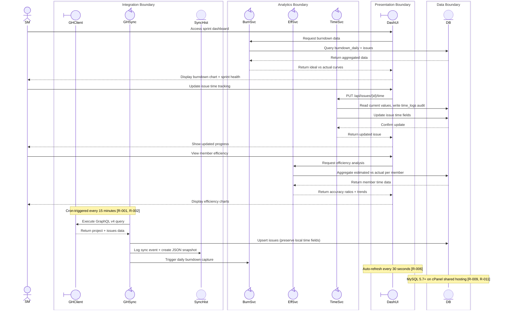
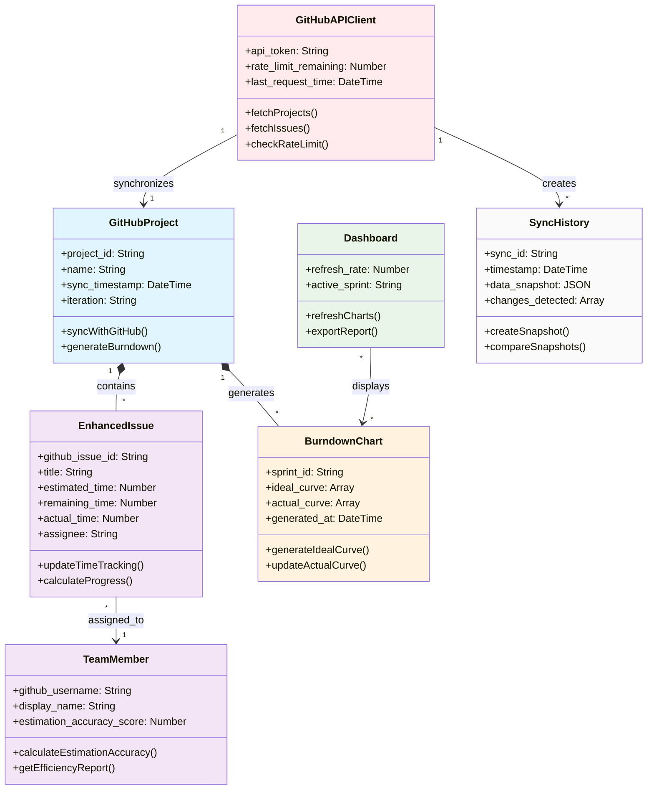
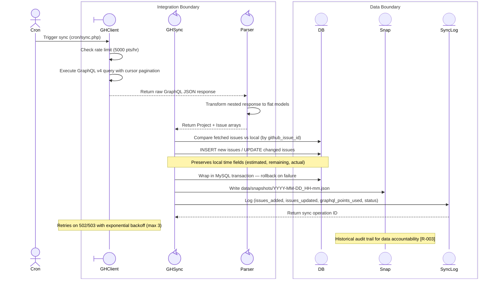
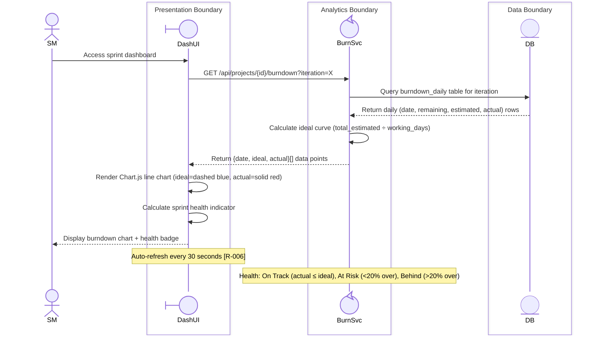
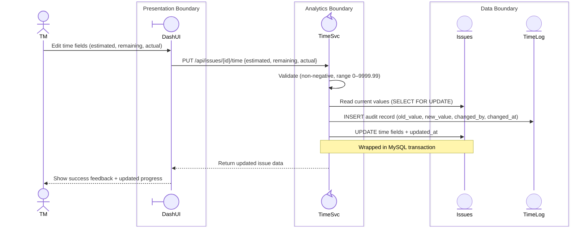
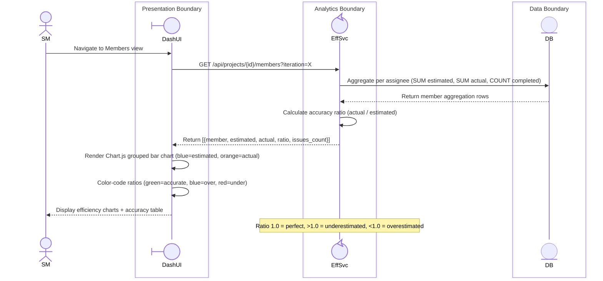
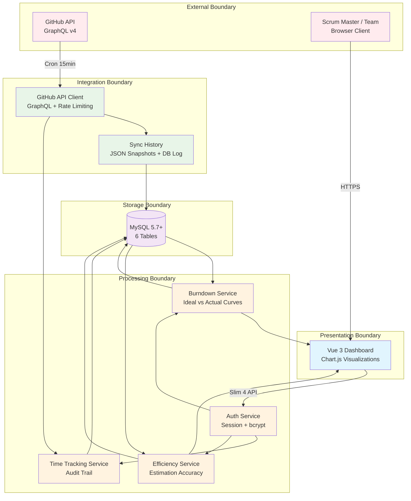
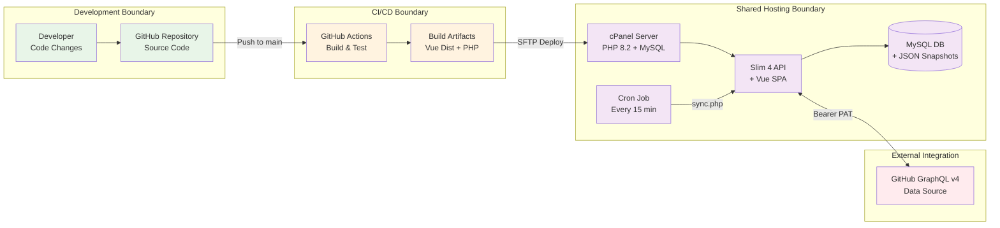

# Collaboration Diagram — Scrum Master Support Process

**Process**: 01 - Scrum Master Support Process  
**Level**: 0  
**Status**: Active  
**Last Updated**: 2026-04-02  
**Source Requirements**: [R-001], [R-002], [R-003], [R-004], [R-005], [R-006], [R-007], [R-008], [R-009], [R-010], [R-011], [R-012]

## Collaboration Overview

This document defines the participants, their stereotypes, boundary groupings, and interaction sequences for the Scrum Master Support Process. The process supports GitHub-integrated Scrum project management through data synchronization, time tracking, burndown analysis, and efficiency reporting.

## System Boundary View *(Diagram CB-001)*

**Source Requirements**: [R-001], [R-005], [R-006], [R-007], [R-008], [R-009]

## Domain Class Model *(Diagram CB-002)*

**Source Requirements**: [R-001], [R-004], [R-007], [R-008]  
**Domain Source**: artifacts/Analysis/domain-concepts.json

## GitHub Data Synchronization Flow *(Diagram CB-003)*

**Source Requirements**: [R-001], [R-002], [R-003]

## Sprint Dashboard Access Flow *(Diagram CB-004)*

**Source Requirements**: [R-005], [R-006], [R-007]

## Time Tracking with Audit Flow *(Diagram CB-005)*

**Source Requirements**: [R-004], [R-006]

## Member Efficiency Analysis Flow *(Diagram CB-006)*

**Source Requirements**: [R-008]

## Data Flow Architecture *(Diagram CB-007)*

**Source Requirements**: [R-002], [R-003], [R-009], [R-011]

## Deployment Architecture *(Diagram CB-008)*

**Source Requirements**: [R-009], [R-010], [R-011]

---

## Participant Registry

| Participant | Stereotype | Boundary | Decomposable | Involvement |
|------------|-----------|----------|-------------|-------------|
| Scrum Master | actor | External | No | Primary user |
| Team Member | actor | External | No | Time tracking |
| cPanel Cron | actor | External | No | Trigger sync |
| Dashboard UI | boundary | Presentation | No | Entry point |
| GitHub API Client | boundary | Integration | No | External API |
| GitHub Sync Service | control | Integration | Yes | Sync orchestration |
| GraphQL Response Parser | control | Integration | Yes | Data transformation |
| Burndown Service | control | Analytics | Yes | Chart calculation |
| Efficiency Service | control | Analytics | Yes | Member analysis |
| Time Tracking Service | control | Analytics | Yes | Audit + update |
| Auth Service | control | Processing | Yes | Session auth |
| MySQL Database | entity | Data | No | Persistence |
| Sync History | entity | Data | No | Audit trail |
| JSON Snapshots | entity | Data | No | Historical data |
| Issues Table | entity | Data | No | Issue storage |
| Time Logs | entity | Data | No | Audit records |

## Boundary Rules Compliance

| Rule | Status | Notes |
|------|--------|-------|
| VR-1: Single External Interface | ✓ Compliant | Each boundary has one external actor entry point |
| VR-2: Boundary-First Reception | ✓ Compliant | External actors always target boundary-type participants first (DashUI, GHClient) |
| VR-3: Control-Only Decomposition | ✓ Compliant | Only control-type participants listed as decomposable |
| VR-4: Cohesive Responsibility | ✓ Compliant | Each boundary groups functionally related participants |

---
<!-- Last Updated: 2026-04-02 -->