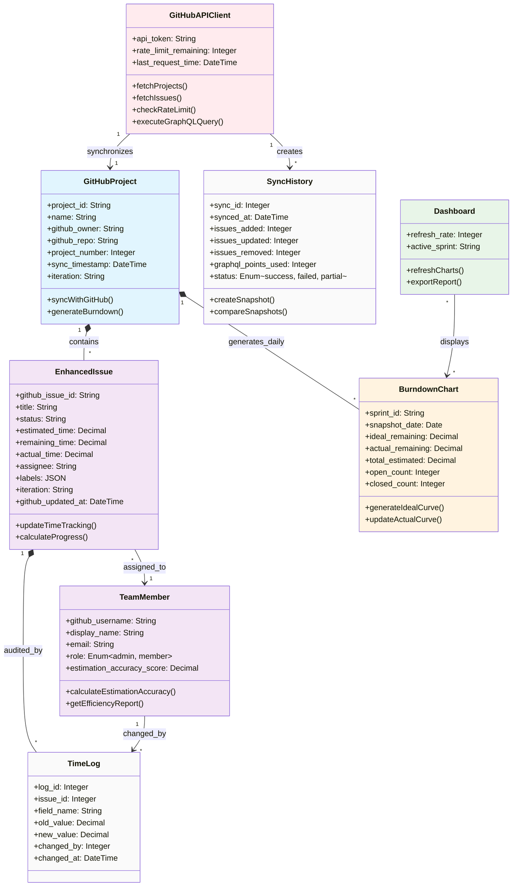

# Domain Model — Scrum Master Support Process

**Process**: 01 - Scrum Master Support Process  
**Level**: 0  
**Status**: Active  
**Last Updated**: 2026-04-02  
**Source Requirements**: [R-001], [R-004], [R-005], [R-007], [R-008]

## Domain Overview

This domain model defines the core entities, relationships, and business rules for the GitHub-integrated Scrum project management dashboard. The system synchronizes GitHub Projects v2 data, augments issues with time-tracking attributes, and provides burndown visualization and efficiency analysis.

## Domain Class Diagram

## Core Domain Entities

### GitHubProject *(ENT-001)*
**Domain**: Project Management | **Confidence**: 95%

Central aggregate representing a GitHub project synchronized to the local system. Acts as the root for all issues and burndown charts within a sprint iteration.

**Key Attributes**: project_id, name, github_owner, github_repo, project_number, sync_timestamp, iteration  
**Operations**: syncWithGitHub(), generateBurndown()  
*Source: [R-001], [R-007]*

### EnhancedIssue *(ENT-002)*
**Domain**: Issue Management | **Confidence**: 95%

GitHub issue augmented with local time-tracking attributes (estimated, remaining, actual hours). GitHub fields sync from API; time fields are locally managed and preserved during sync.

**Key Attributes**: github_issue_id, title, status, estimated_time, remaining_time, actual_time, assignee, labels, iteration  
**Operations**: updateTimeTracking(), calculateProgress()  
**Invariant**: Time fields are never overwritten by GitHub sync — only local users can modify them.  
*Source: [R-004]*

### BurndownChart *(ENT-003)*
**Domain**: Analytics | **Confidence**: 95%

Daily snapshot of sprint progress comparing ideal linear burndown against actual remaining hours. One record per project-iteration-date combination.

**Key Attributes**: sprint_id, snapshot_date, ideal_remaining, actual_remaining, total_estimated, open_count, closed_count  
**Operations**: generateIdealCurve(), updateActualCurve()  
*Source: [R-005], [R-006]*

### TeamMember *(ENT-004)*
**Domain**: Team Analytics | **Confidence**: 90%

Dashboard user with a linked GitHub username. Tracks estimation accuracy over time for efficiency analysis.

**Key Attributes**: github_username, display_name, email, role (admin/member), estimation_accuracy_score  
**Operations**: calculateEstimationAccuracy(), getEfficiencyReport()  
*Source: [R-008]*

### SyncHistory *(ENT-005)*
**Domain**: Audit | **Confidence**: 95%

Record of each GitHub synchronization cycle including counts of issues added/updated/removed, GraphQL API points consumed, and overall status.

**Key Attributes**: sync_id, synced_at, issues_added, issues_updated, issues_removed, graphql_points_used, status  
*Source: [R-002], [R-003]*

### TimeLog *(ENT-006)*
**Domain**: Audit | **Confidence**: 95%

Audit trail entry for every time-tracking field change, recording the old value, new value, who made the change, and when.

**Key Attributes**: log_id, issue_id, field_name, old_value, new_value, changed_by, changed_at  
*Source: [R-004]*

### GitHubAPIClient *(ENT-007)*
**Domain**: Integration | **Confidence**: 95%

Service responsible for GitHub GraphQL v4 API communication, rate limit tracking, cursor pagination, and retry logic.

**Key Attributes**: api_token, rate_limit_remaining, last_request_time  
**Operations**: fetchProjects(), fetchIssues(), checkRateLimit(), executeGraphQLQuery()  
**Constraint**: Max 5000 rate limit points per hour; retries on 502/503 with exponential backoff.  
*Source: [R-001], [R-002]*

### Dashboard *(ENT-008)*
**Domain**: Presentation | **Confidence**: 90%

Vue 3 SPA presenting burndown charts, issue tables, and efficiency visualizations. Auto-refreshes every 30 seconds.

**Key Attributes**: refresh_rate, active_sprint  
**Operations**: refreshCharts(), exportReport()  
*Source: [R-006], [R-007]*

## Entity Relationships

| Source | Relationship | Target | Cardinality | Description |
|--------|-------------|--------|-------------|-------------|
| GitHubProject | contains | EnhancedIssue | 1:many | Project aggregates issues |
| EnhancedIssue | assigned_to | TeamMember | many:1 | Issue has single assignee |
| GitHubProject | generates_daily | BurndownChart | 1:many | Daily snapshots per iteration |
| Dashboard | displays | BurndownChart | many:many | Dashboard shows charts |
| GitHubAPIClient | creates | SyncHistory | 1:many | Each sync creates a log |
| GitHubAPIClient | synchronizes | GitHubProject | 1:1 | Client syncs one project |
| EnhancedIssue | audited_by | TimeLog | 1:many | Each time change logged |
| TeamMember | changed_by | TimeLog | 1:many | User attribution |

## Business Rules

1. **Time Field Sovereignty**: Local time-tracking fields (estimated_time, remaining_time, actual_time) are never overwritten during GitHub synchronization. Only authenticated dashboard users can modify these values.
2. **Sync Idempotency**: Running sync multiple times produces no duplicate data — uses github_issue_id as unique key for upsert.
3. **Audit Completeness**: Every time field modification creates a TimeLog record with old_value, new_value, changed_by.
4. **Rate Limit Respect**: GitHubAPIClient must check remaining points before executing queries; skip sync if approaching limit.
5. **Burndown Daily Capture**: After each sync, the system captures a daily burndown snapshot (UPSERT on date+iteration).

## Key Business Concepts

| Concept | Definition | Source |
|---------|-----------|--------|
| Sprint Health | Overall assessment of sprint progress based on burndown deviation from ideal | [R-007] |
| Estimation Accuracy | Ratio of actual_time to estimated_time per team member (1.0 = perfect) | [R-008] |
| Data Synchronization | One-way read sync from GitHub GraphQL v4 to local MySQL | [R-001], [R-002] |
| Burndown Analysis | Visual comparison of planned vs actual work remaining over time | [R-005] |
| Decision Support | Data-driven insights for Scrum masters to improve sprint outcomes | Goals |

## Terminology Glossary

| Term | Definition |
|------|-----------|
| **GraphQL v4** | GitHub's query language API for fetching structured project data |
| **Burndown Chart** | Line chart showing remaining work (hours) over sprint days |
| **Estimation Accuracy** | Ratio: actual_time ÷ estimated_time (1.0 = exact, >1.0 = underestimated) |
| **Sprint Health** | Indicator comparing actual vs ideal burndown (On Track / At Risk / Behind) |
| **PAT** | Personal Access Token for GitHub API authentication |
| **Cursor Pagination** | GraphQL pagination using opaque cursors for fetching next page |

---
<!-- Last Updated: 2026-04-02 -->