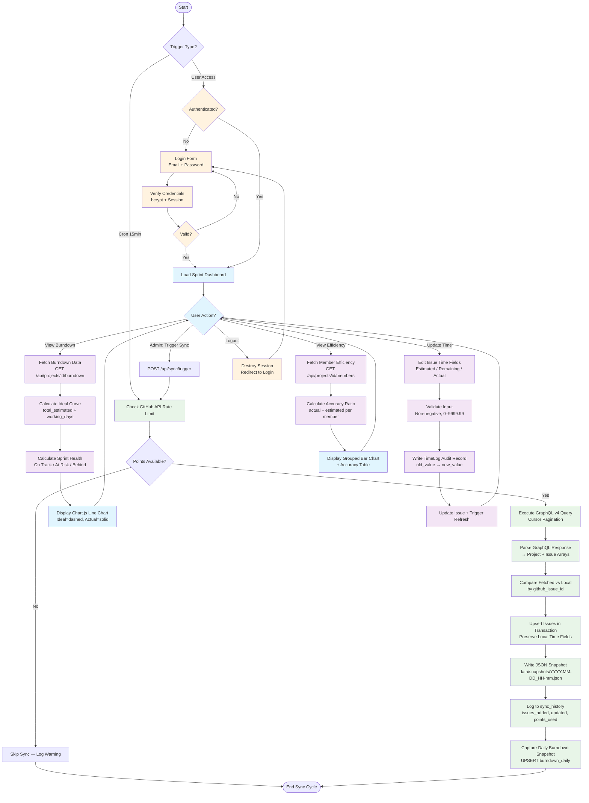

# Process Flow — Scrum Master Support Process

**Process**: 01 - Scrum Master Support Process  
**Level**: 0  
**Status**: Active  
**Last Updated**: 2026-04-02  
**Source Requirements**: [R-001], [R-002], [R-004], [R-005], [R-006], [R-007], [R-008]

## Process Overview

This document defines the activity flows for the GitHub-integrated Scrum project management dashboard. The system operates through two primary process paths: automated data synchronization (cron-driven) and interactive dashboard usage (user-driven).

## Activity Diagram

## Process Description

### Path A: Automated GitHub Synchronization (Cron-Driven)

#### 1. Rate Limit Check
The cron job (every 15 minutes) first checks the GitHub API rate limit. If insufficient points remain (of the 5000/hour budget), the sync cycle is skipped and a warning is logged.

#### 2. GraphQL Data Fetch
Executes a GraphQL v4 query against GitHub Projects v2 using cursor-based pagination. Fetches project metadata, all issues with title, status, assignee, labels, iteration, and timestamps.

#### 3. Response Parsing
The GraphQL response parser transforms the nested JSON response into flat Project and Issue model arrays suitable for database persistence.

#### 4. Diff and Upsert
Compares fetched issues against local database by `github_issue_id`. Inserts new issues and updates changed ones. **Critical invariant**: local time-tracking fields (estimated, remaining, actual) are never overwritten during sync. All DB operations are wrapped in a MySQL transaction.

#### 5. Snapshot and Audit
Writes a JSON snapshot to `data/snapshots/` for historical audit trail [R-003]. Logs the sync event to `sync_history` with counts and GraphQL points consumed.

#### 6. Daily Burndown Capture
After sync, aggregates remaining_time totals per iteration and upserts into the `burndown_daily` table for chart generation.

### Path B: Interactive Dashboard Usage (User-Driven)

#### 1. Authentication
Session-based authentication with bcrypt password verification. Session ID regenerated on login to prevent fixation attacks. Two roles: admin (full access) and member (read + time tracking).

#### 2. Sprint Dashboard
Main view displays burndown line chart (ideal vs actual curves). The ideal curve is calculated as linear decrease from total estimated hours. Sprint health indicator: On Track (actual ≤ ideal), At Risk (<20% over), Behind (>20% over). Auto-refreshes every 30 seconds.

#### 3. Time Tracking
Inline editing of estimated, remaining, and actual time per issue. Input validation ensures non-negative values in range 0–9999.99. Each change creates a TimeLog audit record (old_value, new_value, changed_by). Update wrapped in database transaction.

#### 4. Efficiency Analysis
Per-member aggregation of estimated vs actual time across completed issues. Accuracy ratio: actual ÷ estimated (1.0 = perfect). Displayed as grouped bar chart with color-coding (green = accurate, red = underestimated, blue = overestimated).

#### 5. Admin Functions
Admin users can trigger manual sync and manage dashboard users (create, list). Non-admin users receive 403 on admin endpoints.

## Boundary Rules Applied

- **VR-1** (Single External Interface): External actors (Scrum Master, Cron) each enter through a single boundary participant (Dashboard UI, GitHub API Client)
- **VR-2** (Boundary-First Reception): First message from each external actor targets a boundary-type participant

## Error Handling

- **GitHub API Failure (502/503)**: Retry with exponential backoff (max 3 attempts), then log failure to sync_history
- **Rate Limit Exceeded**: Skip sync cycle, log warning, retry on next cron cycle
- **Invalid Time Input**: Return 422 with validation errors
- **Auth Failure**: Return 401, no user enumeration in error messages
- **DB Transaction Failure**: Rollback and return 503

## Performance Requirements

- API response time < 200ms for all dashboard endpoints
- Sync cycle completes within 60 seconds
- Frontend bundle < 500KB gzipped
- Burndown queries use pre-calculated `burndown_daily` table (no heavy aggregation at request time)

---
<!-- Last Updated: 2026-04-02 -->