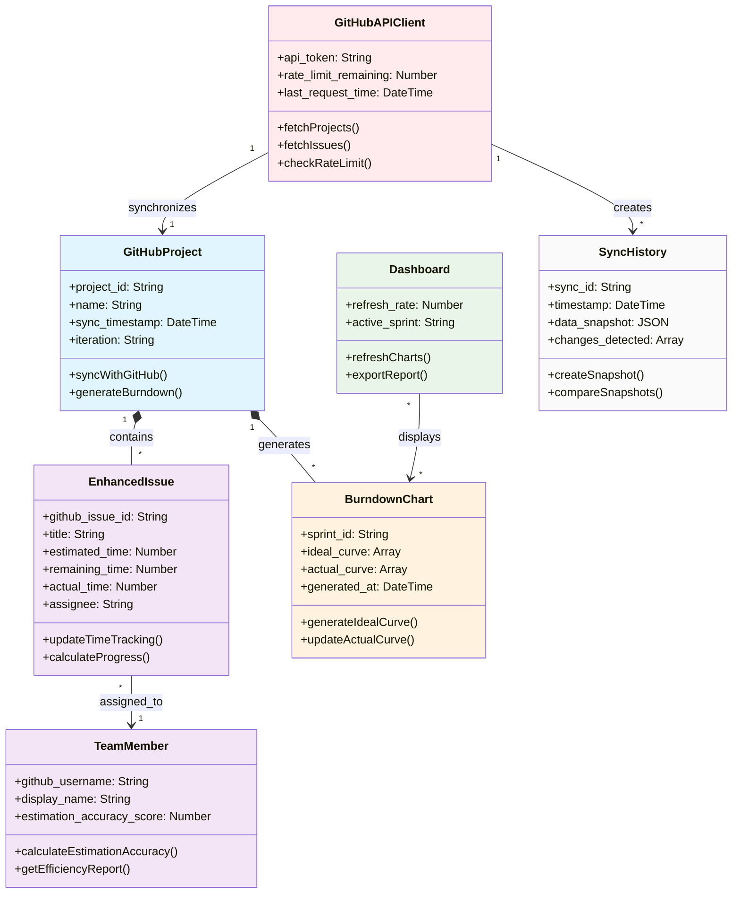
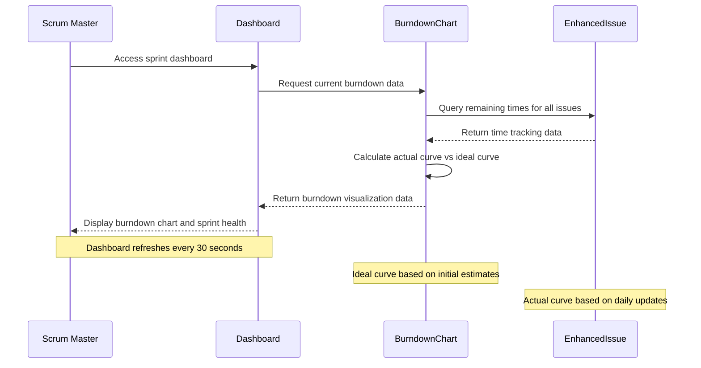
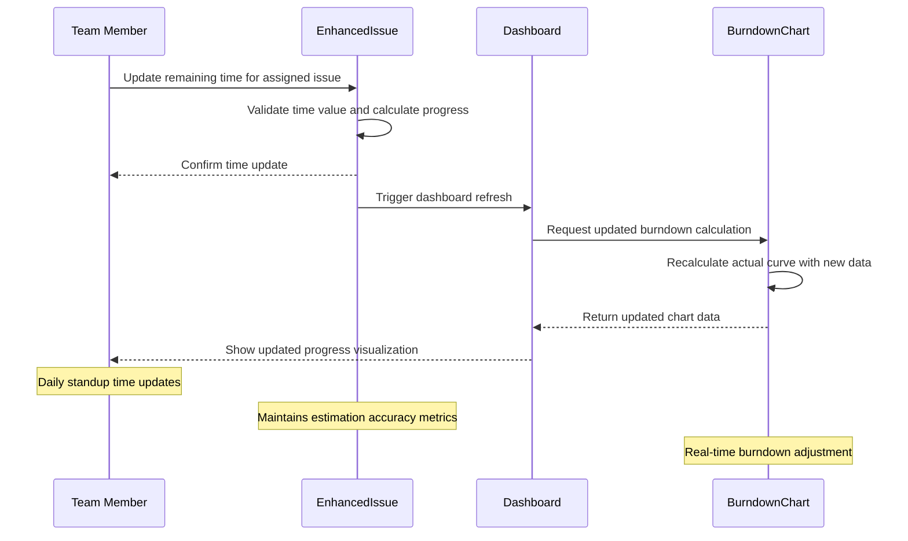
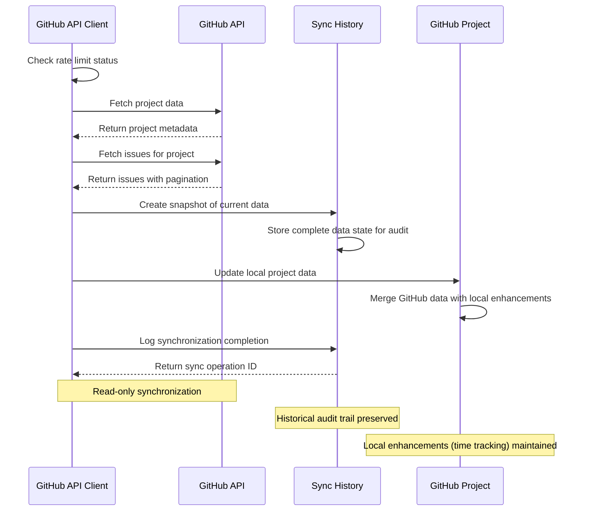
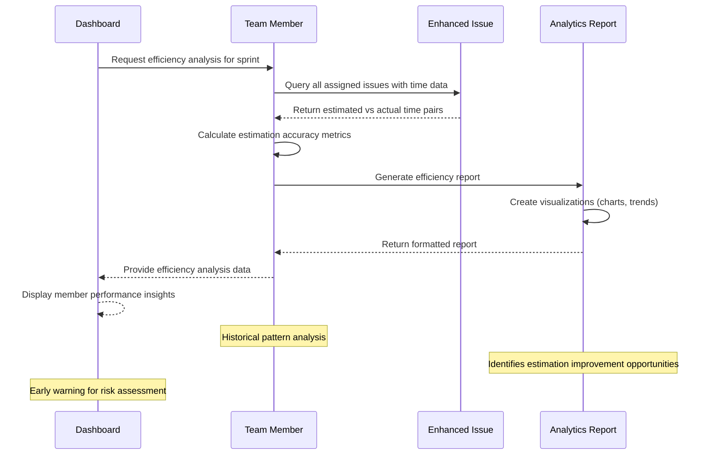
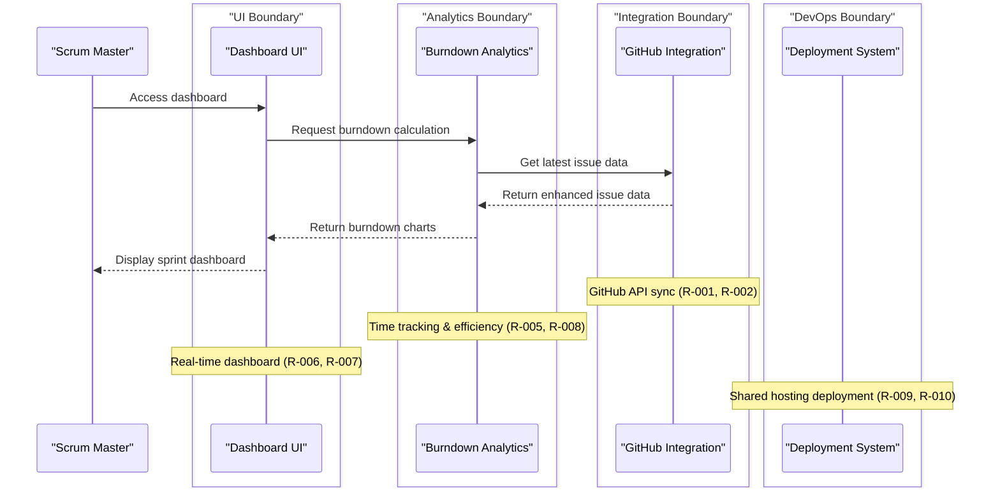
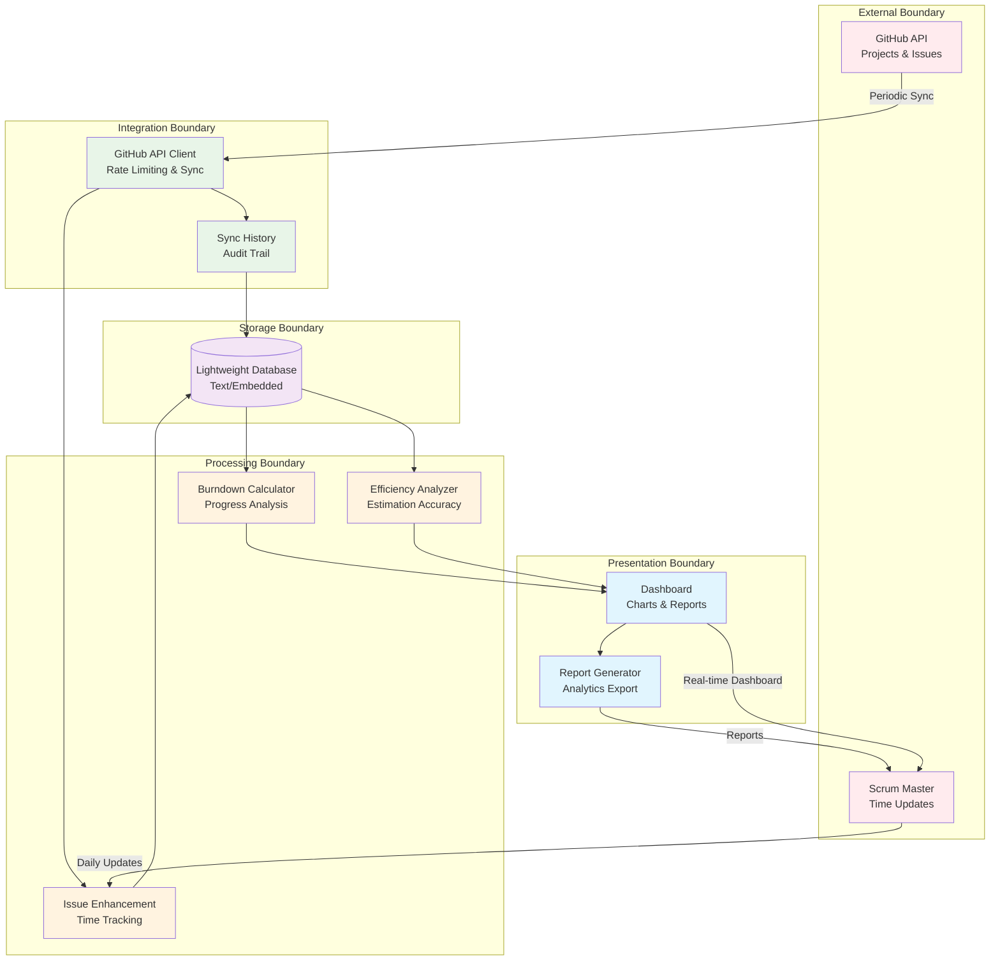
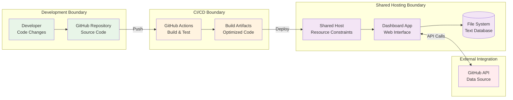

# Collaboration Diagrams

**Project**: PRJ-01 - Scrum Master Assistant  
**Generated**: 2026-04-02T14:45:00Z  
**Source**: domain-concepts.json, requirements.json

## Domain Class Model

### Entity Relationship Overview *(Diagram D-001)*
**Source Requirements**: [R-001], [R-004], [R-007], [R-008]  
**Domain Source**: artifacts/Analysis/domain-concepts.json

## User-System Interactions

### Sprint Dashboard Access Flow *(Diagram D-002)*
**Source Requirements**: [R-007], [R-006]  
**Entities Involved**: Scrum Master, Dashboard, BurndownChart, EnhancedIssue

### Time Tracking Update Flow *(Diagram D-003)*
**Source Requirements**: [R-004], [R-006], [R-008]  
**Entities Involved**: Team Member, EnhancedIssue, Dashboard

## System-System Interactions

### GitHub Data Synchronization Flow *(Diagram D-004)*
**Source Requirements**: [R-001], [R-002], [R-003]  
**Entities Involved**: GitHubAPIClient, GitHub API, SyncHistory, GitHubProject

### Efficiency Analysis Generation Flow *(Diagram D-005)*
**Source Requirements**: [R-008]  
**Entities Involved**: TeamMember, EnhancedIssue, Dashboard

## Hierarchical Collaboration Diagrams

### System Boundary View *(Diagram D-006)*
**Source Requirements**: [R-001], [R-009], [R-010]
**Boundary Detection**: Integration, Analytics, UI, DevOps

### Data Flow Architecture *(Diagram D-007)*
**Source Requirements**: [R-002], [R-003], [R-011]
**Architecture Boundaries**: External, Integration, Processing, Storage, Presentation

## Deployment Architecture *(Diagram D-008)*
**Source Requirements**: [R-009], [R-010], [R-011]
**DevOps Boundaries**: Development, CI/CD, Shared Hosting

---

## Diagram Summary

**Total Diagrams Generated**: 8  
**Coverage**: Domain Model, User Interactions, System Integration, Architecture  

### Boundary Analysis Results:
- **Integration Boundary**: GitHub API synchronization and data management
- **Analytics Boundary**: Burndown calculation and efficiency analysis
- **UI Boundary**: Dashboard presentation and user interaction  
- **DevOps Boundary**: Deployment automation and hosting management
- **Storage Boundary**: Lightweight database operations

### Key Interaction Patterns:
1. **Real-time Updates**: Dashboard refreshes based on time tracking changes
2. **Periodic Sync**: GitHub data pulled at regular intervals with audit trail
3. **Analytics Generation**: On-demand efficiency reports with historical analysis
4. **Deployment Automation**: CI/CD pipeline for shared hosting deployment

---
**Collaboration Analysis Complete** ✅  
**Requirements Fully Visualized** | **Ready for Implementation Planning** 🚀